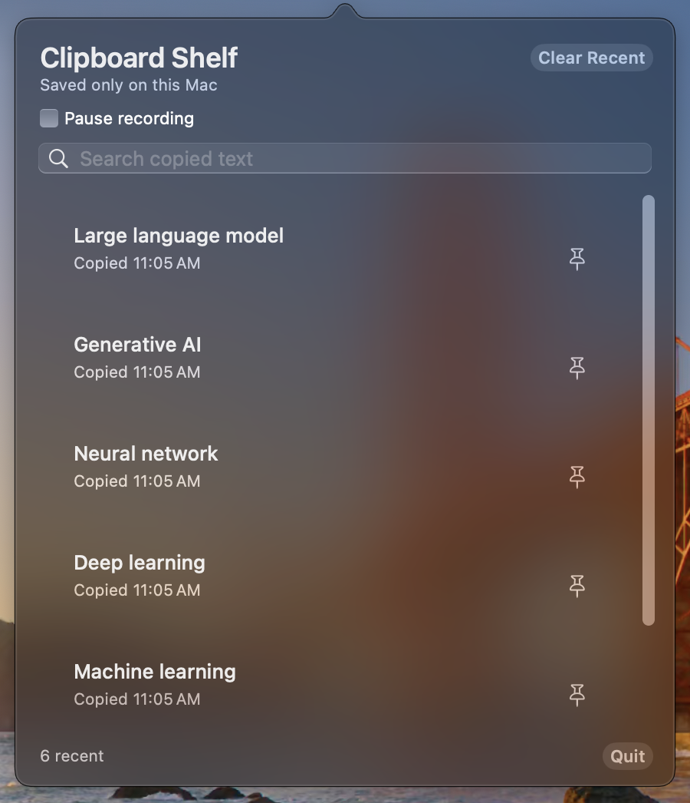

<p align="center">
  
</p>

<h1 align="center">Clipboard Shelf</h1>

<p align="center">A quiet macOS menu-bar clipboard history with search, pins, and a pause switch.</p>

<p align="center"><a href="https://github.com/9phfr6dsw4-dotcom/clipboard-shelf/releases/latest"><strong>Download the latest release</strong></a> · macOS 13+ · Apple silicon and Intel</p>

<p align="center">
  <a href="https://github.com/9phfr6dsw4-dotcom/clipboard-shelf/releases/latest"></a>
  
  <a href="https://github.com/9phfr6dsw4-dotcom/clipboard-shelf/actions/workflows/macos-ci.yml"></a>
  <a href="LICENSE"></a>
</p>

<p align="center"></p>

## Features

- Case-insensitively search the 20 most recent copied text items and copy one back with a click.
- Pin favorites, clear recent items without removing pins, or pause recording at any time.
- Skip concealed, transient, auto-generated, and known password-manager clipboard items. Recording also pauses while Apple Passwords or Keychain Access is frontmost.
- Runs in the menu bar with no Dock icon.

## Install

1. Download the ZIP from the latest release and unzip it.
2. Move **Clipboard Shelf.app** to your **Applications** folder before opening it.
3. Open it once.
4. Click its clipboard icon in the menu bar to search or use your history.

<details>
<summary>First launch on macOS</summary>

The release is ad-hoc signed and not notarized. If macOS blocks it, go to **System Settings → Privacy & Security → Open Anyway**, confirm, then reopen Clipboard Shelf from Applications. No additional macOS privacy permission is required.

</details>

## Privacy

Clipboard history and preferences are stored locally in macOS `UserDefaults`. Clipboard Shelf has no networking or analytics code. Use **Pause recording** whenever you do not want new copies saved.

<details>
<summary>Build and test</summary>

On a Mac with Apple Command Line Tools or Xcode:

```sh
bash Scripts/test.sh
bash Scripts/build.sh
```

The build creates a Universal 2 app and validates its bundle, signature, architectures, and packaged self-test.

</details>
